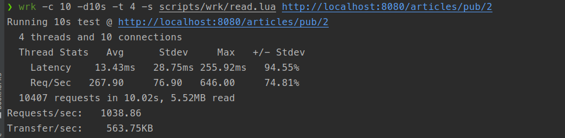
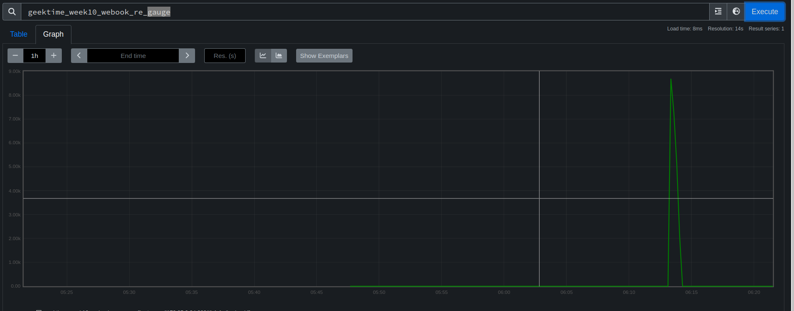

# 第十周第八次作业

## 作业要求

**为消息队列添加监控**

在使用 Kafka 的时候，我为 Sarama 的 ConsumerClaim 添加了一个二次封装。

现在要求你在我的代码基础上，补充监控的内容，这一个是补充 Prometheus 的监控。

你要提交一个文档：

具体修改的文件。
解释你用了什么指标来监控，以及为什么用这个指标。
假设你在实践中，基于这个监控，你认为要设置告警，你会怎么设置。

## 监控指标说明

增加一个当前尚未消费消息的 `Gauge` 度量，来指示当前 Topic 是否存在消费积压。

## 压测指标

## 代码快捷跳转

