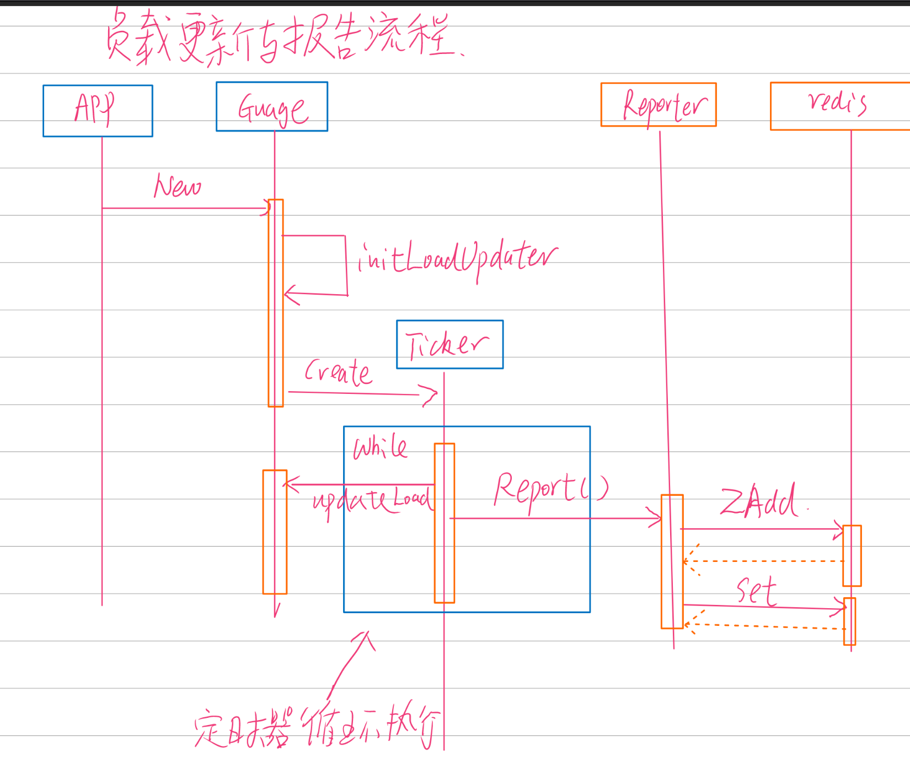
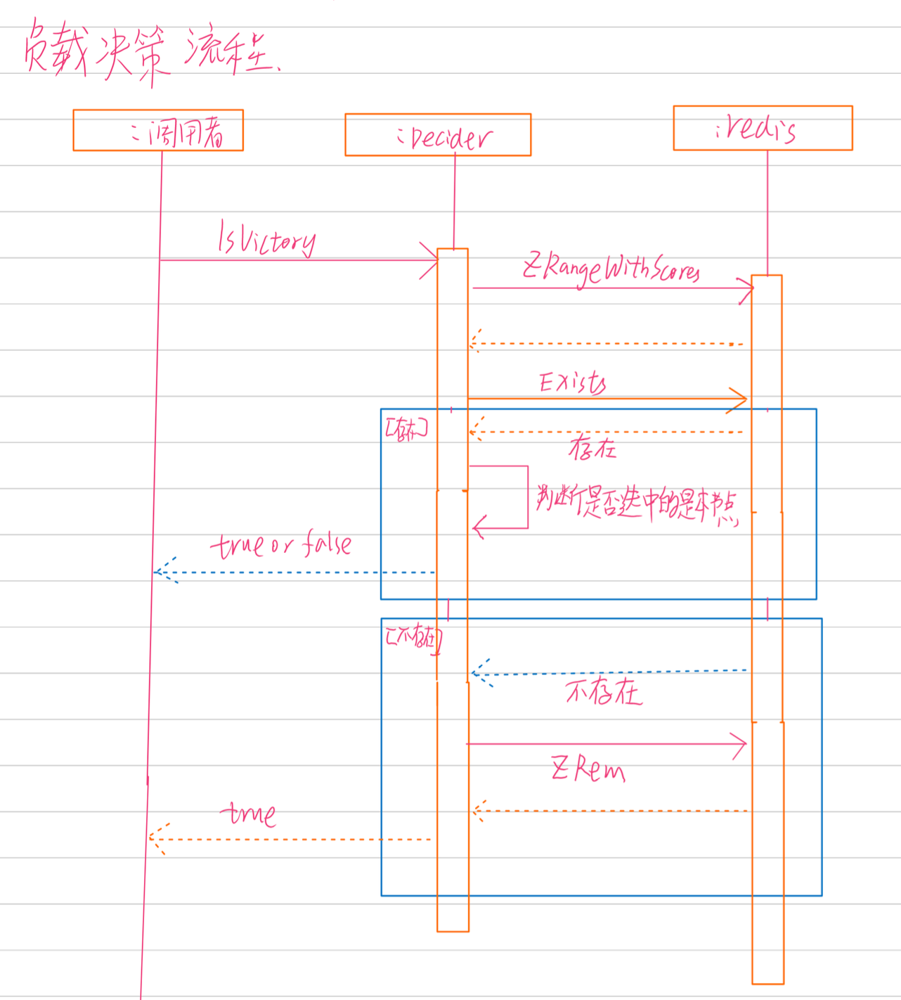
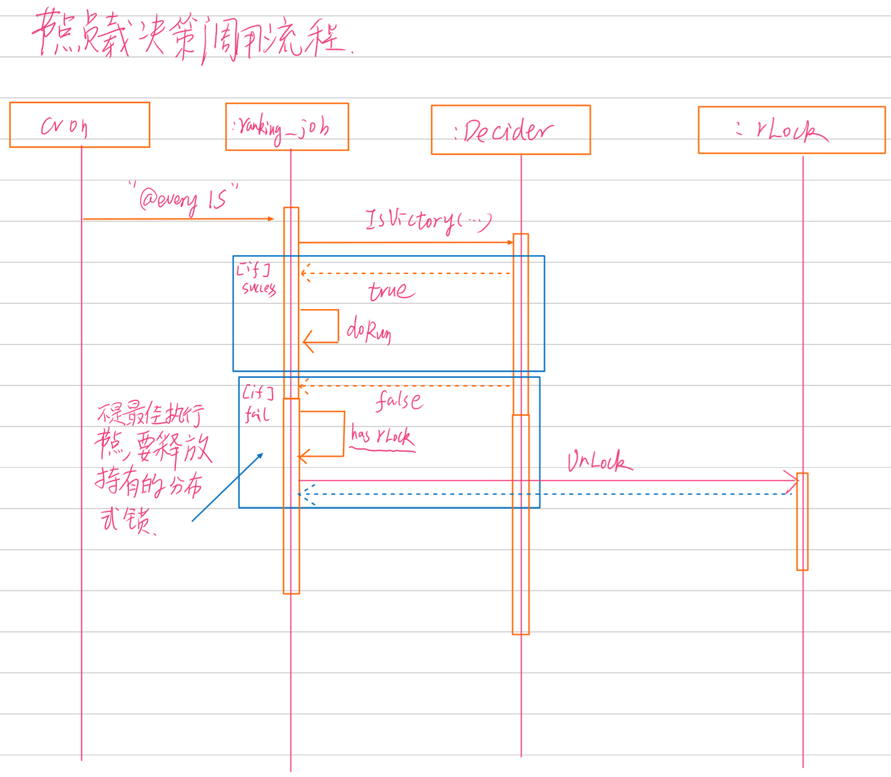
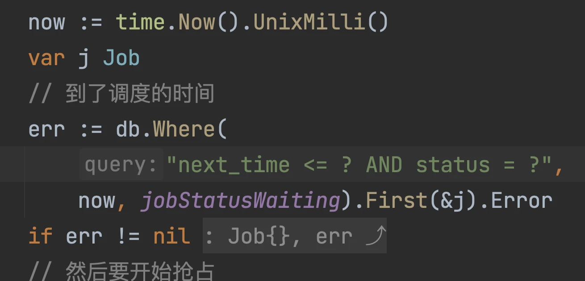

# 第十一周第九次作业

**选择最合适的节点**

在使用 Redis 的分布式锁方案中，我们在筛选节点的时候，并没有考虑节点的真实负载，而是谁先抢到分布式锁，谁就负责接下来的热榜计算。

但是在非常罕见的业务场景下，你会考虑选择负载更加低的节点来执行热榜计算。又或者在拿到了分布式锁之后，突然发现自己的负载变高了，这个时候你就要考虑让出这个分布式锁。

现在你要做的就是设计一个方案，考虑节点负载情况，在选择节点来计算热榜的时候，总是能够选中负载比较低的节点。

模拟节点负载：随机生成一个 0-100 的数字，代表该节点的负载，并且在运行期间可以间隔一定时间就重新生成随机数，代表节点负载变化。

## 作业要求

对实时性的要求并不高。也就是说，并不是节点的负载一变化，你就要考虑换节点，可以有一定的延迟；
并不需要确保每次都是选择了最佳节点，只需要大部分情况下能够选中负载比较低的节点就可以；
就使用 Redis，不允许引入额外的中间件。
提交：

一个文档，解释你的思路，配上对应的 UML 序列图，并且列出关键实现的 URL（方便助教老师批改）
分析极端情况。即有没有可能选中最差的节点？如果选中的节点宕机了，会发生什么？

## 解答

### 实现思路

1. 使用 redis 的 zset 记录各个节点的负载信息， score 是负载， member 是服务的唯一标识，比如 ip+port
2. 同时用 redis 服务用唯一标识建立一个带 `EXPIRE` 时间的 key
3. go 启动一个 goroutine 定时更新 1,2 的记录
4. 如果 2 建立的 key 失效了，说明节点很久没有上报负载数据了，需要被剔除
5. 当调度执行时，先获取负载排名中最低的那一个服务器的唯一标识
6. 如果这个唯一标识在 2 中建立的 key 过期了，则主动清理 zset 的那个key 的数据
7. 如果没有过期，且该唯一标识和当前服务的唯一标识相同，则执行 ranking 的正常流程
8. 如果唯一标识和当前服务的唯一标识不同，则看看当前服务是否持有锁，如果持有，则立即释放

### 实现思路图解

### 代码快捷连接

1. [快速跳转 -> 服务唯一标识器实现](./webook/internal/loaddecider/server_identity.go)
2. [快速跳转 -> 负载指标收集器实现](./webook/internal/loaddecider/load_gauge.go)
3. [快速跳转 -> 负载信息上报器实现](./webook/internal/loaddecider/load_reporter.go)
4. [快速跳转 -> 低负载决策器实现](./webook/internal/loaddecider/decider.go)

# 第十一周第十次作业

**抢占接口的查询条件**

我们在讨论到抢占式的任务调度的时候，MySQL 的实现里面，使用了续约机制。

但是我们对应的 SQL 没有加入续约失败的查询条件。

也就是说，实际上一个任务被调度有两个条件：

* 没人调度，这个查询条件我们已经有了。
* 曾经有人调度，但是后面续约失败了， 也就是这个调度的节点，可能已经崩溃了。

现在需要你修改下面代码中的查询条件，支持第二种情况。

## 解答

[快速跳转 -> 代码 34 行](./webook/internal/repository/dao/job.go#L36)