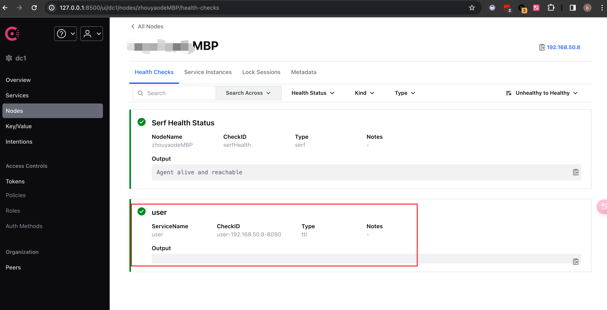

# 第十三次作业

## 要求

换用其它中间件作为注册中心，用单元测试写一个简单的 demo。

包含：

一个方法，启动服务端。
一个方法，启动客户端并且发起调用。
中间件你可以随便选择，并且假设我是面试官，你来回答这个问题：你为什么选择这个中间件作为注册中心。

## 实现

使用 gozero 来连接 consul 注册中心。
zero-contrib 有 consul 的 grpc `resolver` 实现。

### 快速跳转

[代码快速跳转](./grpc/go_zero_consul_test.go)