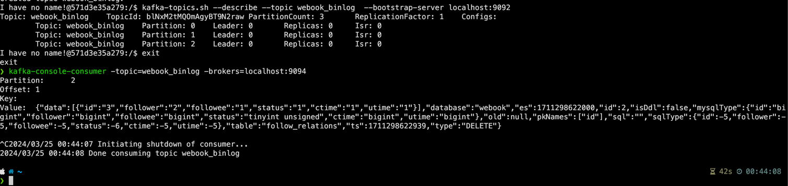

## 作业：Follow 中监听 Canal 并且更新计数

在用户关系中，我们有一个操作是要维持住 Redis 中的粉丝数量和关注了多少人的数量。

* 现在要求你修改这一部分的实现：
* 已有的代码里面，不再需要操作 Redis 了。
* 监听 Canal。如果 A 关注了 B，那么就增加 A 的关注人数，并且增加 B 的粉丝数。
* 注意处理取消关注。

这里，你可以认为，Redis 中的缓存永不过期。

## 实现

### 问题记录
1. `- KAFKA_CREATE_TOPICS=webook_binlog:3:1` 这个设置有坑？ 调试的时候，发现并没有创建 3 副本的 topic。导致 canal 发消息报错.
```log
2024-03-25 00:23:16.615 [pool-5-thread-1] ERROR c.a.o.canal.connector.kafka.producer.CanalKafkaProducer - Invalid partition given with record: 1 is not in the range [0...1).
org.apache.kafka.common.KafkaException: Invalid partition given with record: 1 is not in the range [0...1).
	at org.apache.kafka.clients.producer.KafkaProducer.waitOnMetadata(KafkaProducer.java:920) ~[na:na]
	at org.apache.kafka.clients.producer.KafkaProducer.doSend(KafkaProducer.java:794) ~[na:na]
	at org.apache.kafka.clients.producer.KafkaProducer.send(KafkaProducer.java:784) ~[na:na]
	at org.apache.kafka.clients.producer.KafkaProducer.send(KafkaProducer.java:671) ~[na:na]
	at com.alibaba.otter.canal.connector.kafka.producer.CanalKafkaProducer.produce(CanalKafkaProducer.java:268) ~[na:na]
	at com.alibaba.otter.canal.connector.kafka.producer.CanalKafkaProducer.send(CanalKafkaProducer.java:261) ~[na:na]
	at com.alibaba.otter.canal.connector.kafka.producer.CanalKafkaProducer.send(CanalKafkaProducer.java:166) ~[na:na]
	at com.alibaba.otter.canal.server.CanalMQStarter.worker(CanalMQStarter.java:181) [canal.server-1.1.5.jar:na]
	at com.alibaba.otter.canal.server.CanalMQStarter.access$100(CanalMQStarter.java:25) [canal.server-1.1.5.jar:na]
	at com.alibaba.otter.canal.server.CanalMQStarter$CanalMQRunnable.run(CanalMQStarter.java:223) [canal.server-1.1.5.jar:na]
	at java.util.concurrent.ThreadPoolExecutor.runWorker(ThreadPoolExecutor.java:1149) [na:1.8.0_181]
	at java.util.concurrent.ThreadPoolExecutor$Worker.run(ThreadPoolExecutor.java:624) [na:1.8.0_181]
```
2. 后来手动建立的 Topic
```shell
kafka-topics.sh --delete --topic webook_binlog  --bootstrap-server localhost:9092
kafka-topics.sh --create --bootstrap-server localhost:9092 --replication-factor 1 --partitions 3 --topic webbook_binlog
```



### 快速跳转

1. [follow_event实现](./webook/follow/events/follow_event.go)
2. [follow_event 启动调用](./webook/follow/main.go#L14)
3. [InactiveFollowRelation 改造](./webook/follow/repository/followrelation.go#L62)
4. [AddFollowRelation 改造](./webook/follow/repository/followrelation.go#L92)


