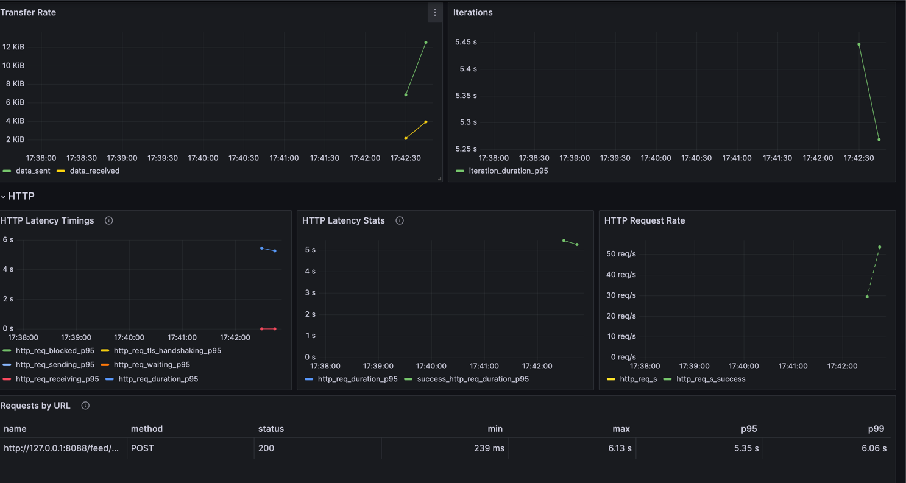

## 压测脚本

1. 准备数据
执行 data_test.go 下的 Test_ADDFeed

2. 启动feed的测试服务器 
```
    运行 data_test.go 下的Test_Feed函数

```
3. 准备prometheus
```
修改docker-compose的配置文件
   prometheus:
    image: prom/prometheus:v2.47.2
    volumes:
#      - 将本地的 prometheus 文件映射到容器内的配置文件
      - ./prometheus.yaml:/etc/prometheus/prometheus.yml
    ports:
#      - 访问数据的端口
      - 9090:9090
    command:
       # 开启remote writer
      - "--web.enable-remote-write-receiver"
      - "--config.file=/etc/prometheus/prometheus.yml"      
```

4. 准备grafana
    datasource 选择上面的prometheus
   模版选择：https://grafana.com/grafana/dashboards/19665-k6-prometheus/
5. 运行压测脚本
```
cd webook/feed/test/stress_test
 # 声明k6运行结果投递到响应的prometheus上
export K6_PROMETHEUS_RW_SERVER_URL="http://localhost:9090/api/v1/write"
export K6_PROMETHEUS_RW_TREND_STATS="p(50),p(90),p(95),p(99),min,max"
 #下载k6 
mac的下载方式 brew install k6
# 运行部分从 push 取，部分从 pull 取的压测
k6 run -o experimental-prometheus-rw stress_mixedevent_test.js
# 去grafana上查看压测结果
# 运行 完全从 push 里面取的压测
k6 run -o experimental-prometheus-rw stress_pushevent_test.js
# 去grafana上查看压测结果
# 运行 完全从 pull 里面取的压测  
k6 run -o experimental-prometheus-rw stress_pullevent_test.js   
# 去grafana上查看压测结果
# 运行写测试扩散百人
k6 run -o experimental-prometheus-rw stress_add100_test.js
# 去grafana上查看压测结果
# 运行写测试扩散千人
k6 run -o experimental-prometheus-rw stress_add1000_test.js
# 去grafana上查看压测结果
# 运行写测试扩散万人
k6 run -o experimental-prometheus-rw stress_add10000_test.js
# 去grafana上查看压测结果

```
6. 截图

扩散万人的


扩散千人



扩散百人


从pull事件中取数据


从push事件中取数据


从混合事件中取数据

