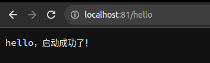

# 第三次作业

将应用发布到 k8s 环境中。

## svc 截图


## pod 截图


## 访问 webook 截图 

**指定了 ingress ngnix controller 端口为 81 和 4433** 

参见 [遇到的坑](#遇到的坑)



## 遇到的坑

### 坑一

由于 k3s 默认会安装一个 `traefik` 作为默认 `ingress controller`, 所以如果要安装 `ingress-nginx` 需要修改 helm 默认配置，安装命令如下：

```sh
helm upgrade --install ingress-nginx ingress-nginx \
--repo https://kubernetes.github.io/ingress-nginx \
--namespace ingress-nginx --values override.yaml \
--create-namespace
```

`override.yaml` 内容如下：

```yaml
controller:
  service:
    ports:
      http: 81
      https: 4433
```

修改了 `ingress-nginx` 默认端口到 81, 4433


### 坑二

外部的科学上网会导致 pod 的 按照服务名查找服务地址出现问题，需要关闭代理，启动好了再打开。