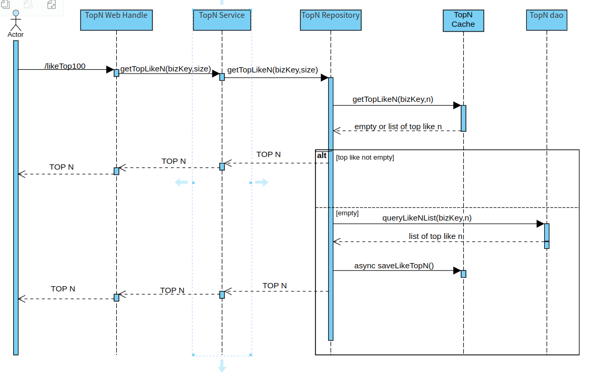

# 第九周第七次作业

## 作业要求
**找出点赞数量前 N 的数据**

这一次的面试要点和作业是同一个东西。有一个高频面试题：如果要你找出按照点赞数量前 N 个数据，怎么做？

这一次的作业就是要求你解决这个问题，设计一个高性能方案，要求：
综合考虑可以怎么利用缓存，包括 **Redis 和本地缓存**。
允许业务折中，但是你要说清楚你准备怎么折中。

提交代码和一个文档，其中文档：

* 核心接口、类的代码位置（HTTP 地址）。
* 绘制 UML 序列图，至少包含两张图：缓存命中与未命中的场景。
* 性能测试结果，推荐使用 wrk。要在结果中告知你的机器参数、性能测试在不同输入参数下的结果。

## 代码快捷跳转

* [实现的接口定义]()
* [接口的核心实现]()

## 接口 uml 序列图

### 缓存命中时 && 缓存未命中时

## 性能测试截图

