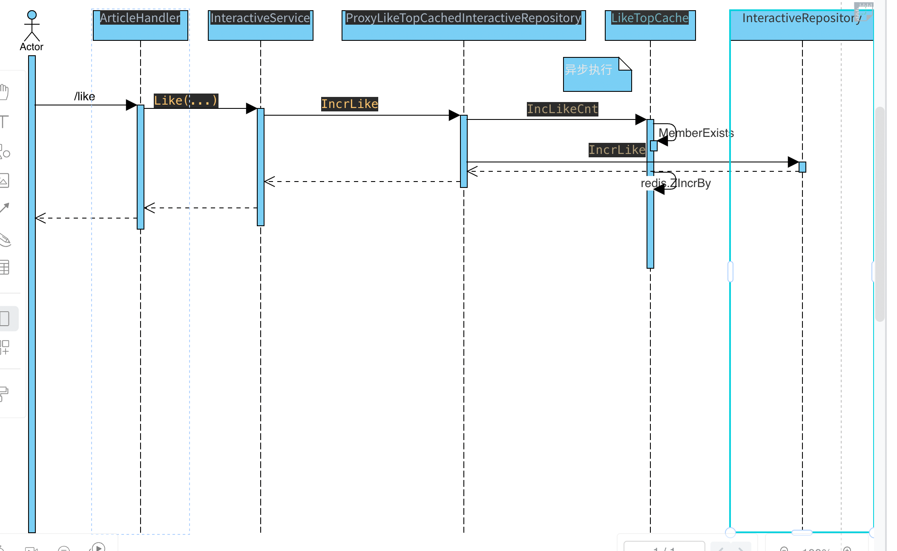
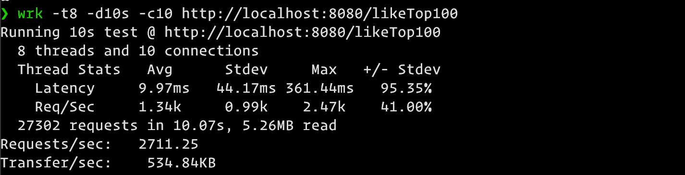

# 第九周第七次作业


## 作业要求
**找出点赞数量前 N 的数据**

这一次的面试要点和作业是同一个东西。有一个高频面试题：如果要你找出按照点赞数量前 N 个数据，怎么做？

这一次的作业就是要求你解决这个问题，设计一个高性能方案，要求：
综合考虑可以怎么利用缓存，包括 **Redis 和本地缓存**。
允许业务折中，但是你要说清楚你准备怎么折中。

提交代码和一个文档，其中文档：

* 核心接口、类的代码位置（HTTP 地址）。
* 绘制 UML 序列图，至少包含两张图：缓存命中与未命中的场景。
* 性能测试结果，推荐使用 wrk。要在结果中告知你的机器参数、性能测试在不同输入参数下的结果。

## 实现的核心逻辑

1. 如果首次查询点赞榜，缓存没有时，从数据库查询榜单，维护到 redis 的 zset 里面。
2. 如果非首次查询点赞榜，缓冲命中，直接从缓存获取。
3. 如果榜单 top 名单内的点赞数出现新的个人点赞/取消，就直接对器 zset 进行 ZIncrBy 操作。
4. 定期从数据库重新同步新的榜单准确数据，保证突发的新星的急剧冒头。（比如一天，或几个小时）

## 代码快捷跳转

* [cache 层接口定义与实现](./webook/internal/repository/cache/like_top.go)
* [dao 层接口定义与实现](./webook/internal/repository/dao/like_top.go)
* [repository 层接口定义与实现](./webook/internal/repository/like_top.go)
* [repository 层点赞代理接口定义与实现](./webook/internal/repository/topn_proxy_interactive.go)
* [service 层接口定义与实现](./webook/internal/service/like_top.go)
* [web 接口的定义与实现](./webook/internal/web/like_top.go)

## 优化

为了优化首次到数据库查询 TopN 到点赞数， 需要增加如下索引来提升查询速度:

```sql
CREATE INDEX idx_top_like_cnt ON interactives (biz asc, like_cnt desc);
```

查询 sql 为 
```sql
SELECT i.biz_id, i.like_cnt FROM interactives i WHERE i.biz = 'article' ORDER BY i.like_cnt desc LIMIT 100
```

## 接口 uml 序列图

### 缓存命中时 && 缓存未命中时


### 新的点赞时流程



## 性能测试截图


